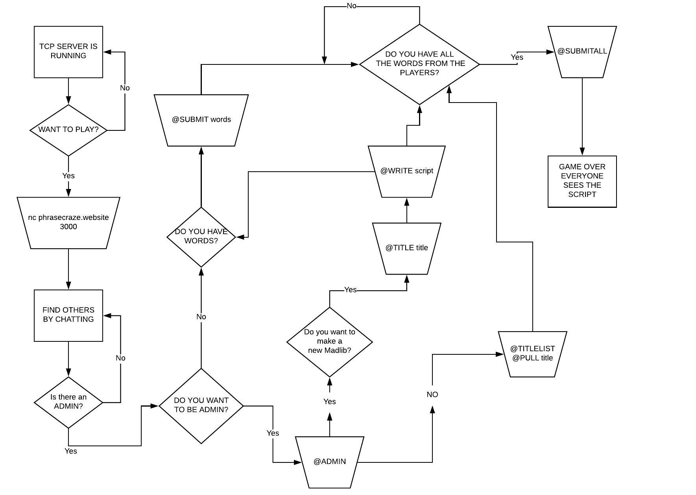
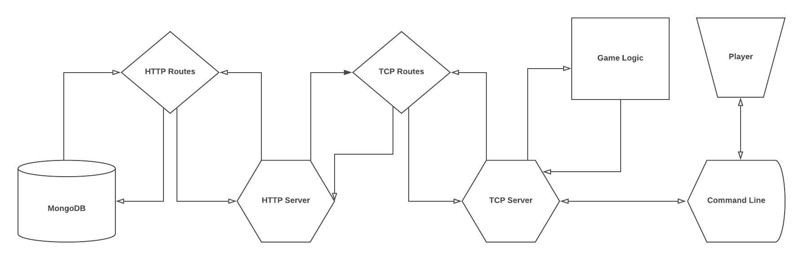

# PhraseCraze: A Multi-player TCP Experience!

```
  ########::'##::::'##:'########:::::'###:::::'######::'########::'######::'########:::::'###::::'########:'########:
  ##.... ##: ##:::: ##: ##.... ##:::'## ##:::'##... ##: ##.....::'##... ##: ##.... ##:::'## ##:::..... ##:: ##.....::
  ##:::: ##: ##:::: ##: ##:::: ##::'##:. ##:: ##:::..:: ##::::::: ##:::..:: ##:::: ##::'##:. ##:::::: ##::: ##:::::::
  ########:: #########: ########::'##:::. ##:. ######:: ######::: ##::::::: ########::'##:::. ##:::: ##:::: ######:::
  ##.....::: ##.... ##: ##.. ##::: #########::..... ##: ##...:::: ##::::::: ##.. ##::: #########::: ##::::: ##...::::
  ##:::::::: ##:::: ##: ##::. ##:: ##.... ##:'##::: ##: ##::::::: ##::: ##: ##::. ##:: ##.... ##:: ##:::::: ##:::::::
  ##:::::::: ##:::: ##: ##:::. ##: ##:::: ##:. ######:: ########:. ######:: ##:::. ##: ##:::: ##: ########: ########:
 ..:::::::::..:::::..::..:::::..::..:::::..:::......:::........:::......:::..:::::..::..:::::..::........::........::
```

# Contents
* [Authors](#authors)
* [Introduction](#introduction)
* [Getting Started](#getting-started)
* [Commands](#commands)
* [Packages & Dependencies](#packages)
### Authors: 
- [Collin Meredith](https://github.com/melody2m) 
- [Sean Miller](https://github.com/Deliman206) 
- [Wyatt Pefley](https://github.com/peffles) 
- [Panos Kumasaka](https://github.com/spinaltaper)  
- [Mike Castor](https://github.com/vibecastor)
## Introduction:
PhaseCraze is a word game that is derived from the popular word game "Mad-Libs". The game uses a TCP and an HTTP server in order to work. Players join a socket and declare an admin. The admin is in charge of writing the script with the keywords that will be replaced by words from the players. Once the script is written, the keywords are distributed to all the players and they will insert their own words that they would like to see in the story. Once every player has submitted their words, the admin will enter the @submitall command and the script is reconstructed with the players words substituted in for the generic keywords that were put in by the admin. Thank you for playing PhraseCraze!
## Getting Started:
Playing a game with your friends is easy!
1. For Mac and Linux users, type ```nc phrasecraze.website 3000```
  - If the nc command does not work, Install the [Net Cat](#http://netcat.sourceforge.net/) networking utility. 
- For Windows users, open [PUTTY](https://www.ssh.com/ssh/putty/download) and input "phrasecraze.website" into the "Host Name" input field, and 3000 in the "Port" input field. Also make sure "Connection Type" is set to TELNET.
2. You will then be put into the socket and you are now able to play a game and chat with other players!
3. To begin the game sequence, an admin must be declared. To declare yourself as the admin, just simply type "@admin".
4. When you are the admin, you can write a script and use brackets to declare the words you want substituted. For example: "[Boy_Name] and [Girl_Name] went up the hill to fetch a(n) [object]". You can also pull a script from the database using @pull [title]. To see titles in the database, use @titlelist.
5. After the script is written or pulled, the program will deconstruct it and send keywords to players.
6. If you are a player, you type "@submit" and then the words you want to hear in the story separated by spaces.
7. After every player has submitted their words, the admin uses the "@submitall" command. This command reconstructs the script with user generated words in place of the generic keywords.
8. Read your story!

## Hosting Your Own Game
1. Download all dependencies listed in the package-lock.json file using the node package manager command install.

    ```npm i```

2. If you are a OSX or Linux user, run in the root folder run dbon in your terminal.

    ```npm run dbon```

3. If you are a Windows user, run windbon in your terminal.

    ```npm run windbon```

4. Have your friends connect to your ip address, found easily at whatismyipadress.com, port 3000.

5. Play the game as detailed above.

## Commands:
1. ```@admin``` 
- Makes the player who typed the command the admin and gives them access to the ```@title```, ```@write```,  ```@submitall```, and ```@notadmin``` commands.
2. ```@commands``` - Displays a list of all the commands.
3. ```@rules``` - Displays the rules of the game.
4. ```@notadmin``` - Removes admin status (assuming you are the admin).
5. ```@title``` - Creates a title for the script you are about to write, (assuming you are the admin). This example sets up a script named 'There and Back Again'

        
        @title There And Back Again
         

6. ```@write``` - Writes a custom script. This creates text inside the script with the brackets inside being the keywords the players will replace. 

    ```@write In a hole in the [location]  there lived a [species]. Not a [adjective], [adjective],  [adjective] [location], filled with the ends of [animal plural] and a [adjective] smell or a dry bare sandy [location] with nothing  in it to [verb] on or to [verb]: it was a [species]-[location] and that means [quality].``` 

7. ```@submit``` - Submits your words (assuming you are a player and not an admin). Submissions must be separated by spaces.

        
        @submit dog wet New_York
        

8. ```@submitall``` - Initiates the reconstruction of the script with player generated words in place of generic keywords (assuming you are the admin).
9. ```@mywords``` - Displays your keywords (assuming you are a player and not the admin).
10. ```@pull There And Back Again``` - Pulls a certain script from the database and distributes its keywords to the players.
11. ```@titlelist``` - Displays a list of all scripts in the database by title.

#Project Architecture:


##Game Logic Diagram:




##MVC Architecture Overview:




## Packages
```npm i``` to download all required packages!
- [Chalk](https://www.npmjs.com/package/chalk) - Pretty colors in terminal.
- [Express](https://www.npmjs.com/package/express) - HTTP server routing.
- [Mongoose](https://www.npmjs.com/package/mongoose) - Asynchronous object modeling tool that allows asynchronous calls to the database.
- [MongoDB](https://www.npmjs.com/package/mongodb) - Allows the game to create a database.
- [dotenv](https://www.npmjs.com/package/dotenv) - loads environment variables from a .env file into process.env.
- [faker](https://www.npmjs.com/package/faker) - Generates mock user names for a fun twist to the game.
- [Winston](https://www.npmjs.com/package/winston) - Logging utility.
- [Body-parser](https://www.npmjs.com/package/body-parser) - Middleware that parsers the body of incoming request objects.
